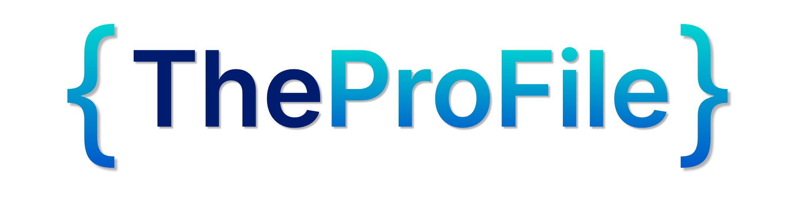

<div align="center">
  
  <h1>TheProFile</h1>
  <p><strong>Portfolio-as-Code. Zero HTML. Maximum Impact.</strong></p>

  <p>
    <a href="https://jekyllrb.com/"></a>
    <a href="https://github.com/SriSatyaLokesh/TheProFile/actions/workflows/deploy.yml"></a>
    <a href="https://opensource.org/licenses/MIT"></a>
  </p>
</div>

---

## What is TheProFile?

**TheProFile** is a high-fidelity, single-page developer portfolio template built on **Jekyll** and hosted natively on **GitHub Pages**.

It follows the **Portfolio-as-Code** philosophy:
No dragging-and-dropping. No fighting with CSS specificity. No wrestling with React hydration.

You edit a single `profile.json` file. TheProFile handles the rest.

### ✨ Features
- 🚀 **Zero-Code Setup**: If you can write JSON, you can build a stunning portfolio.
- 🎨 **Dynamic Vanta.js Backgrounds**: 6 configurable interactive WebGL backgrounds (`net`, `waves`, `rings`, `fog`, `birds`, `clouds`).
- 🌗 **Elite Dark & Light Modes**: 360° interactive theme toggle with synchronized CSS property animation.
- ✨ **GSAP Entrance Choreography**: Sophisticated staggered reveal animations for a premium, rhythmic landing experience.
- 🫧 **Smart Glassmorphism Nav**: High-fidelity floating navigation with real-time backdrop filtering.
- 🍱 **Bento Grid Skills**: Modern, responsive technical stack layout with interactive hover vibrancy.
- ⚡ **Lightning Fast**: 100/100 Lighthouse-ready architecture minimizing JS overhead.
- 🛡️ **Auto-Generated Shields.io Badges**: Just type the platform name, and we generate the badges dynamically.

---

## 🚀 Quick Start (Deploy in 3 Minutes)

1. **Fork this repository** using the button at the top right of the page.
2. Go into your forked repository and open the `_config.yml` file. Update the `baseurl` and `url` to match your repository (e.g. `baseurl: "/TheProFile"` if your repo is named TheProFile, or `""` if you are using a custom domain). 
3. Open `_data/profile.json` and replace the placeholder data with your own. (Refer to `_data/profile.example.json` for detailed documentation of every field).
4. Go to your repository **Settings > Pages**.
5. Under Build and deployment, change the Source to **GitHub Actions**.

That's it! GitHub Actions will automatically compile your TheProFile and deploy it.

---

## 🛠️ Theming & Configuration

Your entire site's configuration lives inside `_data/profile.json`.

```json
"theme_config": {
  "mode": "dark",
  "vanta_effect": "net",
  "colors": {
    "primary": "#0d1117",
    "secondary": "#161b22",
    "accent": "#58a6ff"
  }
}
```
- Toggle `"mode"` between `"dark"` and `"light"`.
- Switch the `"vanta_effect"` to any of the 6 supported strings above to instantly change your hero site interaction. Set it to `""` to turn off WebGL animations entirely.
- Tweak the hex colors (ensure the `#` is present!) to perfectly map to your personal branding.

---

## 💻 Local Development

If you want to view your changes locally before pushing them:

**Prerequisites:** Ruby >= 3.2, Bundler

```bash
# 1. Install dependencies
bundle install

# 2. Run the Jekyll server with live-reload
bundle exec jekyll serve --livereload

# 3. Open in your browser
open http://localhost:4000/TheProFile/
```

---

## 🤝 Contributing

We welcome community contributions that align with the Portfolio-as-Code philosophy! 
If you want to add a feature, please read the [Contribution Guidelines (CONTRIBUTING.md)](./CONTRIBUTING.md) first to understand our strict architectural constraints (e.g., no Node.js scripts, hard JSON logic).

## 📝 License

Distributed under the MIT License. See `LICENSE` for more information.
